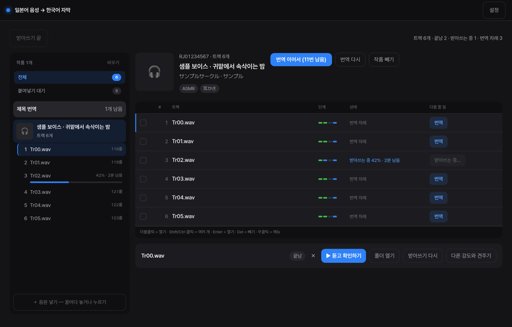
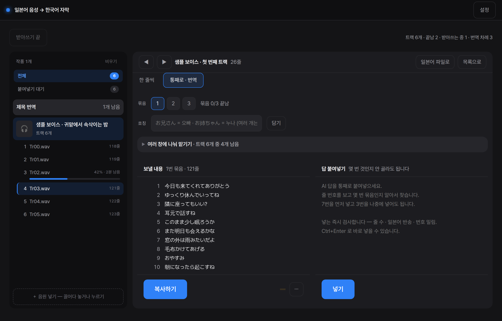
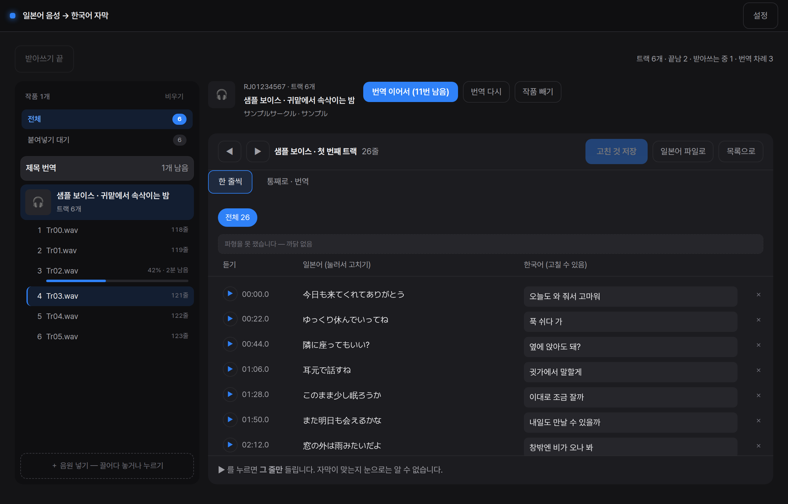

<div align="center">

# 🎧 voice-lrc

**일본어 음성을 한국어 자막으로 — 끌어다 놓고, 복붙하면 끝**

받아쓰기는 내 컴퓨터에서 하고, 번역은 쓰던 AI 채팅(Claude·ChatGPT)에 붙여넣는 방식이라
**API 키도, 추가 요금도 없습니다.**

🎵 음원 &nbsp;→&nbsp; 📝 받아쓰기 (내 컴퓨터) &nbsp;→&nbsp; 💬 AI 채팅에 복붙 &nbsp;→&nbsp; 🎧 `.lrc` 자막 완성

[](LICENSE)




</div>

---

## 📥 설치 — 2단계

**① 내려받기** — 아래 한 줄을 명령 프롬프트에 붙여넣거나, [ZIP으로 받아서](https://github.com/intionma/voice-lrc/archive/refs/heads/main.zip) 압축을 풉니다

```
git clone https://github.com/intionma/voice-lrc.git
```

**② 폴더 안의 `START.bat` 더블클릭**

처음 한 번만 알아서 설치하고(몇 분 걸립니다), 그다음부터는 바로 켜집니다.
처음 켜면 **번역을 어떻게 할지 한 번만 묻습니다** — 쓰는 AI 채팅 / 번역기 / 자동.

> 미리 필요한 것: 윈도우 + [Python 3.11](https://www.python.org/downloads/release/python-3119/)
> (링크 페이지 **아래쪽**의 **Windows installer (64-bit)** 를 받아 설치하고,
> 설치 첫 화면에서 **"Add python.exe to PATH"에 체크**하세요)
> NVIDIA 그래픽카드가 있으면 받아쓰기가 훨씬 빠릅니다 (없어도 동작합니다)

## 🚀 사용법 — 3단계

**① 음원을 창에 끌어다 놓기** — mp3 · wav · m4a, 폴더째로도 됩니다. 받아쓰기가 자동으로 시작됩니다

**② 「번역」 → 「복사하기」** — 복사된 내용을 Claude나 ChatGPT 채팅창에 붙여넣습니다

**③ AI가 준 답을 복사해서 오른쪽 칸에 붙여넣기** — 몇 번째 묶음인지 안 골라도 알아서 찾고, 줄이 빠지면 바로 알려 줍니다. 복사만 해도 앱이 알아채고 받아 갑니다



**끝** — 음원 옆에 `.lrc` 자막 파일이 생깁니다. 줄마다 눌러서 들어 보고 바로 고칠 수도 있습니다



## 🔄 업데이트

설정 → 점검 → **「업데이트하고 다시 켜기」** 버튼 하나면 됩니다. (`git clone`으로 받았을 때)

<details>
<summary><b>❓ 자주 묻는 질문</b></summary>

<br>

**그래픽카드가 없는데요?**
느리지만 동작합니다. CPU만으로는 20분 음원에 수십 분쯤 걸립니다.
(RTX 4070 Ti 기준으로는 2분 내외)

**자동으로 하고 싶어요.**
설정에서 「내 컴퓨터 AI나 API로 자동」을 고르면 됩니다. 기본이 복붙인 것은
쓰던 AI 구독을 그대로 쓰게 하려고요 — API를 붙이면 쓸 때마다 돈이 나갑니다.
복사한 내용에는 줄 번호가 붙어 있어서, AI가 줄을 빼먹거나 밀리면 앱이 잡아냅니다.

**자막을 폰에서 보려면?**
`.lrc`를 지원하는 음악 앱에 음원과 자막을 같은 이름으로(`01.mp3` → `01.lrc`)
같은 폴더에 넣으면 됩니다.

**트랙이 많아요.**
창을 여러 개 열어 트랙을 하나씩 맡기세요. 답은 **아무 순서로나** 받아도
제 트랙으로 들어갑니다. 번역 화면의 「여러 창에 나눠 맡기기」에서 트랙마다 복사합니다.

**받아쓰기가 이상해요.**
설정에서 받아쓰기 강도를 바꿔 보세요. 트랙마다 「다른 강도와 견주기」로
직접 비교할 수도 있습니다.

**자막이 어디에 생기나요?**
음원 바로 옆에 같은 이름으로 생깁니다 (`01.mp3` → `01.lrc`). 이미 있으면
덮어쓰기 전에 한 번 더 물어봅니다.

**뭔가 이상하게 동작해요.**
설정 화면 아래의 **「문제 알리기」**를 누르면 무슨 일이 있었는지가 클립보드에
들어갑니다. 그대로 붙여넣어 알려 주세요 — 파일을 찾아 첨부하지 않아도 됩니다.
API 키는 들어가지 않습니다.

**앱 아이콘이 안 보여요.**
처음 켤 때 바탕화면과 시작 메뉴에 생깁니다. 지웠으면 앱 폴더의 `START.bat`을
한 번 누르거나, `.venv\.desktop_done` 파일을 지우고 다시 켜세요.

</details>

## 📄 라이선스와 주의

- 코드: [MIT](LICENSE) · 글꼴(Pretendard): [SIL OFL 1.1](app/ui/web/fonts/LICENSE.txt)
- 동인 음성(성인 대상 작품 포함) 감상용 도구입니다. 만든 자막·전사·번역을 **공개
  배포하면 원작 저작권 문제**가 될 수 있습니다. 개인 감상 용도로만 쓰세요.
